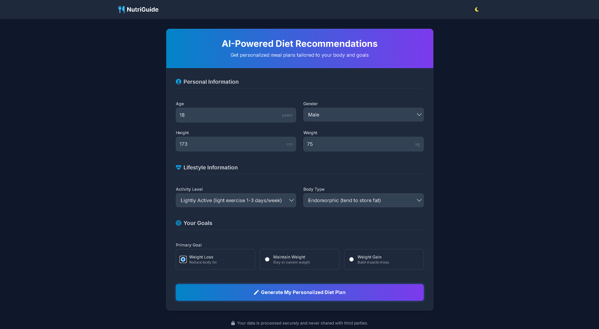
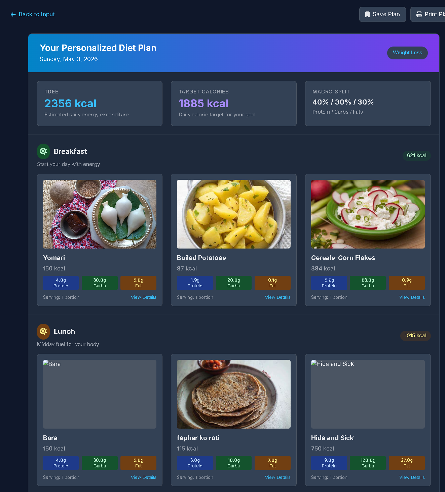
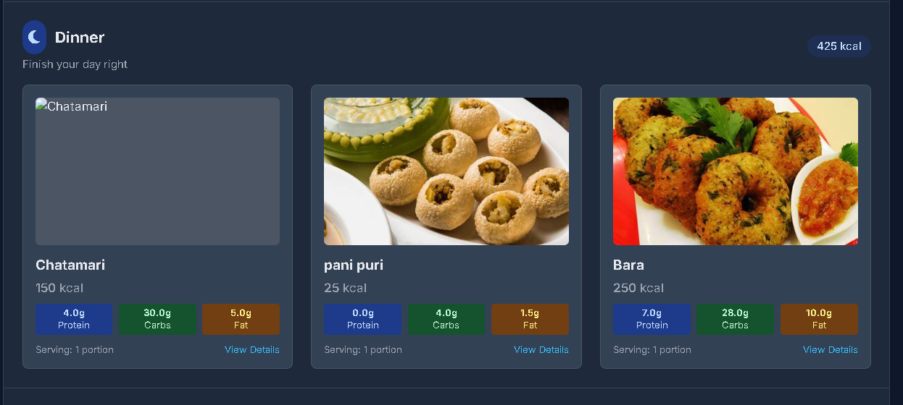
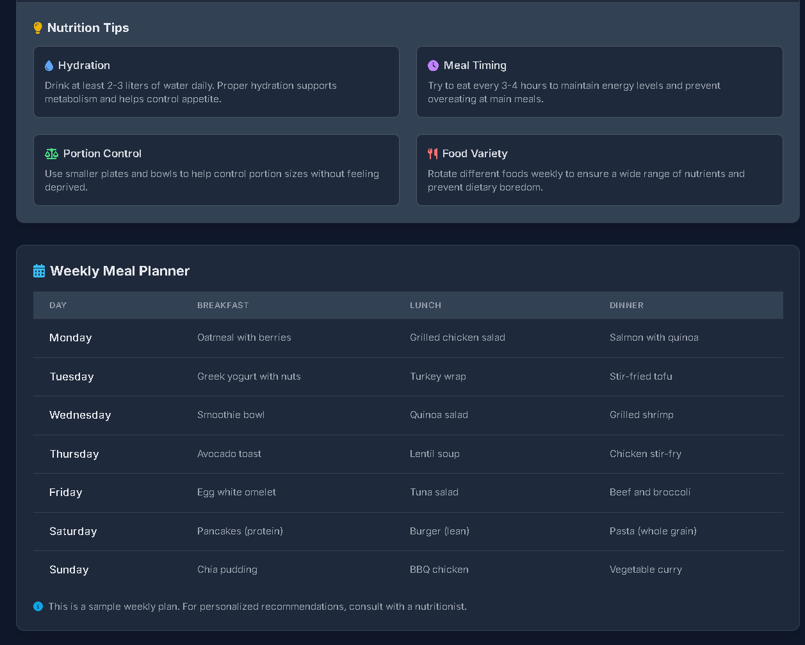

# Diet Recommendation Engine

A Flask web app that generates personalized meal plans using K-Means clustering. Users input their physical stats and health goal — the system calculates their caloric needs and recommends breakfast, lunch, and dinner accordingly.

---

## Stack

- **Backend** — Python, Flask
- **ML** — scikit-learn (K-Means)
- **Data** — pandas, NumPy
- **Frontend** — HTML (Jinja2)

---

## How It Works

1. User provides age, height, weight, activity level, body type, and goal (loss / maintain / gain)
2. BMR is calculated using the Mifflin-St Jeor formula, adjusted per body type (endomorphic, ectomorphic, mesomorphic)
3. TDEE is derived from BMR × activity multiplier, then scaled ±20% based on goal
4. Daily calories are split across meals; food items from each CSV are clustered by nutritional profile (K-Means), and one item per cluster is selected to keep recommendations diverse

---

## Project Structure

```
├── app.py                            # App entry point — routes + recommendation logic
├── Diet_Recommendation_system.ipynb  # Exploratory notebook
├── requirements.txt
├── Data_sets/
│   ├── Breakfast_data.csv
│   ├── Lunch_data.csv
│   └── Dinner_data.csv
└── Templates/
    └── index.html
```

---

## Setup

```bash
git clone https://github.com/sambad-K/Diet_Recommendation_Engine.git
cd Diet_Recommendation_Engine
pip install flask pandas numpy scikit-learn
python app.py
```
----------
## API

`POST /recommend`

```json
{
  "age": 25,
  "height": 175,
  "weight": 70,
  "activity_level": "moderately_active",
  "body_type": "mesomorphic",
  "goal": "weight_loss"
}
```

Returns a structured meal plan with food items, macros, and total calorie targets.

**Valid values**
- `activity_level` — `sedentary`, `lightly_active`, `moderately_active`, `very_active`, `extra_active`
- `body_type` — `endomorphic`, `ectomorphic`, `mesomorphic`
- `goal` — `weight_loss`, `maintain`, `weight_gain`

---

## Dataset Format

Each CSV under `Data_sets/` requires: `Food_items`, `Calories`, `Fats`, `Proteins`, `Carbohydrates`, `Link`

------
# Project Overview

## 📌 Input Panel
<p align="center">
  
</p>

---

## 📌 Recommended Plan 0
<p align="center">
  
</p>

---

## 📌 Recommended Plan 1
<p align="center">
  
</p>

---

## 📌 Tips Section
<p align="center">
  
</p>
